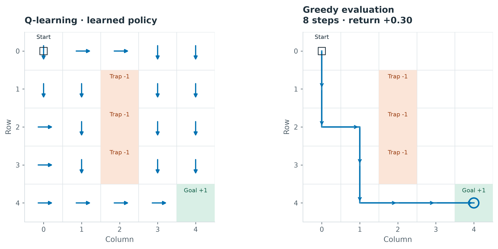
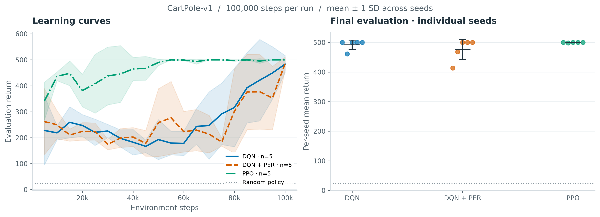

# MinRL

**Learn reinforcement learning by reading the learning loop.**

[](pyproject.toml)
[](LICENSE)

Small implementations of tabular and deep RL, with the mathematics kept close to the code.
Start with a grid, learn a value function, then follow the same ideas into DQN and PPO.
Each agent owns its training loop and update rule. No trainer framework or configuration file
is needed to run the lessons; experiment tracking is an optional next step.



*Q-learning on a 5×5 grid, seed 0, 1,500 episodes. Squares mark the start; the circle marks
the final state. Traps terminate the episode—they are not walls. [Reproduce this figure](examples/plot_gridworld.py).*

## Start in a few minutes

```bash
git clone https://github.com/10-OASIS-01/minrl.git
cd minrl
python3 -m venv .venv                  # Python 3.10 or newer
source .venv/bin/activate              # Windows: .venv\Scripts\activate
python -m pip install -e .
python -m examples.basic_navigation
python -m examples.q_learning_example
```

Or use the locked development environment: `uv sync --python 3.11 --all-extras --frozen`.

```python
from minrl import GridWorld, QLearningAgent

env = GridWorld(size=3)
agent = QLearningAgent(env, seed=0)
rewards, lengths = agent.train(n_episodes=1000, max_steps=100)
policy = agent.get_optimal_policy()
```

## Follow the ideas, in order

| Lesson | Question | Run with `python -m` | Read next |
| --- | --- | --- | --- |
| 1 · Environment | What are state, action and reward? | `examples.basic_navigation` | [GridWorld](src/minrl/environment/grid_world.py) |
| 2 · Planning | What if we know every transition? | `examples.value_iteration_example` | [Value / policy iteration](src/minrl/agents/policy_optimization.py) |
| 3 · Q-learning | Can experience replace the model? | `examples.q_learning_example` | [Q-learning update](src/minrl/agents/q_learning.py) |
| 4 · Monte Carlo | Can we learn from complete returns? | `examples.monte_carlo_example` | [Monte Carlo prediction](src/minrl/agents/monte_carlo.py) |
| 5 · Search | Can we simulate before choosing? | `examples.mcts_example` | [MCTS](src/minrl/agents/mcts.py) |
| 6 · DQN | Can a network replace the table? | `examples.deep_ql_example` | [DQN update and training](src/minrl/agents/deep_q_learning.py) |
| 7 · Actor-critic | Can the critic teach a policy directly? | `examples.actor_critic_example` | [One-step actor-critic](src/minrl/agents/actor_critic.py) |
| 8 · PPO | How do we reuse a rollout carefully? | `examples.ppo_example` | [GAE and PPO](src/minrl/agents/ppo.py) |

The [learning guide](docs/learning-guide.md) connects each equation to its implementation,
explains the training/update flow, and includes small exercises with expected answers.

## What is implemented?

| Method | Environment | Learning data | Save / load |
| --- | --- | --- | --- |
| Policy evaluation; value / policy iteration | GridWorld | Exact transition model | Not needed: recompute |
| Monte Carlo prediction | GridWorld | Complete episodes; first / every visit | Not provided |
| MCTS | GridWorld | Model-based simulations | Not needed: search online |
| Q-learning | GridWorld | Online TD; optional uniform replay | JSON Q-table |
| DQN | Gymnasium discrete actions | Uniform replay; optional PER | PyTorch checkpoint |
| Actor-critic | GridWorld or supported Gymnasium environments | One-step TD | PyTorch checkpoint |
| PPO | Gymnasium discrete actions | On-policy rollout, GAE, clipping | PyTorch checkpoint |

Neural agents accept a discrete observation (one-hot encoded) or a one-dimensional `Box`
observation. They also accept a `GridWorld` directly through a thin Gymnasium adapter.
Boundary actions are masked consistently during selection and learning. True terminations
stop value bootstrapping; time-limit truncations do not.

Advanced options are kept out of the first lessons: prioritized replay, soft target updates,
learning-rate decay, and evaluation-based early stopping are opt-in. See the
[experiment guide](docs/experiments.md) for their defaults and limitations.

## Optional: run and compare experiments

```bash
python -m pip install -e '.[experiments]'
minrl train --config configs/cartpole_ppo.yaml --output runs/ppo-seed0
minrl evaluate --run runs/ppo-seed0 --episodes 100
minrl plot --run runs/ppo-seed0
tensorboard --logdir runs

# DQN, DQN + PER, PPO × five seeds × 100,000 environment steps
minrl benchmark --config configs/benchmark.yaml --output runs/cartpole
```

Every run saves its effective configuration, dependency versions, training CSV,
evaluation JSON, TensorBoard events, and best/final checkpoints. Output folders must be new.
Plotting reads saved results and exports SVG plus 300 DPI PNG without retraining.

### Measured results



CartPole-v1 · 100,000 environment steps per run · seeds 0–4 · CPU.
Each final checkpoint is evaluated on 100 independent-seed episodes. Bands and ± values
show one population standard deviation **across five seed means**, not confidence intervals.

| Method | Final return, mean ± SD | Mean wall time per seed |
| --- | ---: | ---: |
| DQN | 492.28 ± 15.44 | 23.3 s |
| DQN + PER | 476.40 ± 33.65 | 34.7 s |
| PPO | 499.70 ± 0.56 | 29.1 s |
| Random policy | 23.74 | — |

All 15 runs completed; no seeds were dropped or tuned after inspection. PER did not improve
the final mean in this small experiment, and intermediate scores were often non-monotonic.
These are teaching results on one environment, not a general ranking of algorithms.
See [the full protocol and seed-level results](docs/benchmark.md).

## Small codebase, clear responsibilities

```text
src/minrl/
  environment/grid_world.py   # deterministic dynamics + thin Gymnasium adapter
  agents/                    # one algorithm per file; training and math together
    common.py                # encoding, masks, small neural-network helpers
    replay.py                # uniform replay and the optional PER extension
  utils/visualization.py     # plots, independent of learning
  experiments.py             # optional logging, evaluation and command-line runs
examples/                    # short, runnable lessons
tests/                       # hand-computed targets and end-to-end checks
```

Begin with `train()` and then read `update()` / `train_step()` in the same file.
`common.py` does not implement any learning rule. `experiments.py` is not required reading
until you want to compare multiple runs.

## Documentation and contributing

- [Learning guide and exercises](docs/learning-guide.md)
- [DQN: replay and target values](docs/dqn.md)
- [Actor-critic: one-step advantages](docs/docs_algorithms_actor_critic.md)
- [PPO: rollout, GAE and clipped updates](docs/docs_algorithms_ppo.md)
- [Experiments and checkpoint limitations](docs/experiments.md)
- [Migration from 0.1](docs/migration.md)
- [What was fixed](docs/changes.md)

```bash
python -m pip install -e '.[dev,experiments]'
MPLBACKEND=Agg pytest --cov=minrl --cov-report=term-missing
ruff check src tests examples
python -m build
```

Prefer an explicit equation and a readable loop over an abstraction. Contributions should
include a small correctness test, an example when useful, and documentation that describes
the actual implementation. The CI workflow checks Python 3.10–3.12; local validation is
performed on Python 3.11. Coverage numbers in reports are measured, not a promise of correctness.

### Limits and future work

This is a teaching library, not a general-purpose training framework. It currently uses
single-environment CPU training, small MLPs, and discrete actions. It does not provide image
policies, continuous control, vectorized collectors, exact checkpoint resumption, dynamic
obstacles, multi-agent RL or curriculum learning. These are future directions, not implemented
features. Monte Carlo estimates can be noisy and depend on visitation; excessively truncated
episodes are reported and excluded, which can introduce selection bias.

## References and acknowledgments

- Mnih et al., [Playing Atari with Deep Reinforcement Learning](https://arxiv.org/abs/1312.5602).
- Schaul et al., [Prioritized Experience Replay](https://arxiv.org/abs/1511.05952).
- Schulman et al., [Proximal Policy Optimization Algorithms](https://arxiv.org/abs/1707.06347).
- [Gymnasium: handling time limits](https://gymnasium.farama.org/tutorials/gymnasium_basics/handling_time_limits/).
- Thanks to Professor Shiyu Zhao's [Mathematical Foundations of Reinforcement Learning](https://github.com/MathFoundationRL/Book-Mathematical-Foundation-of-Reinforcement-Learning), and the educational work in [CleanRL](https://github.com/vwxyzjn/cleanrl), [simple_rl](https://github.com/david-abel/simple_rl) and [RLCode](https://github.com/rlcode/reinforcement-learning).

Created by Yibin Liu · [MIT license](LICENSE).
