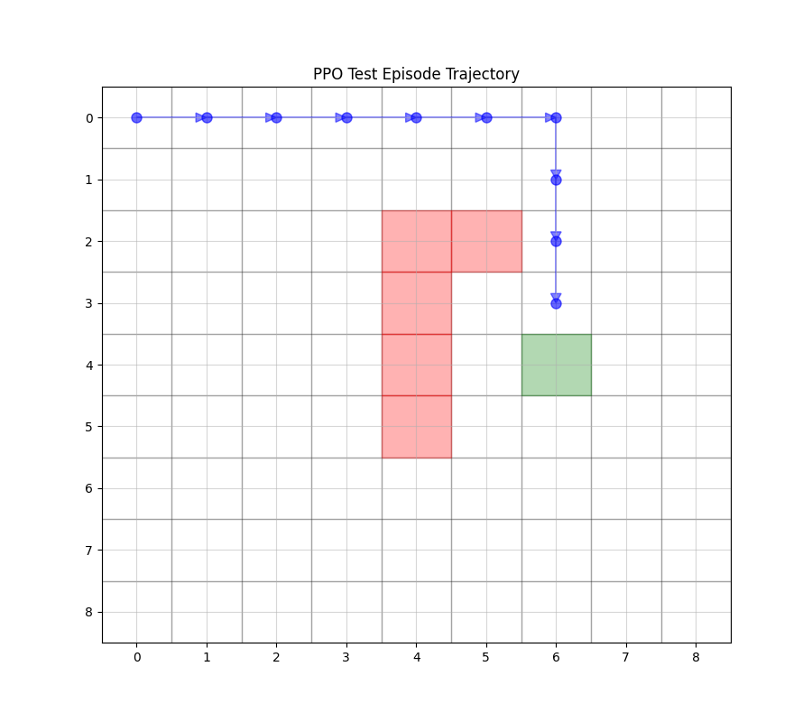

# MinRL: Minimal, Clean Code for Reinforcement Learning

MinRL provides clean, minimal implementations of fundamental reinforcement learning algorithms in a customizable GridWorld environment. The project focuses on educational clarity and implementation simplicity while maintaining production-quality code standards.

## 🌟 Key Features

- **Modular GridWorld Environment**: Customizable grid sizes (3×3, 5×5) with configurable rewards and dynamics
- **Clean Implementation** of core RL algorithms:
  - Policy Evaluation (Bellman Expectation)
  - Monte Carlo Methods (First-visit and Every-visit)
  - Monte Carlo Tree Search (MCTS)
  - Policy Iteration & Value Iteration
  - Tabular Q-Learning
  - Deep Q-Learning (DQN)
  - Actor-Critic Methods
  - Proximal Policy Optimization (PPO)
- **Visualization Tools**: Built-in plotting and state-value visualization
- **Comprehensive Tests**: 100% test coverage with pytest
- **Educational Focus**: Well-documented code with step-by-step examples

**Note:** Monte Carlo methods perform poorly in GridWorld environments with sparse rewards, negative step costs, and mixed terminal states. This is because Monte Carlo methods require longer episodes to explore and learn, while algorithms like Q-learning can learn more effectively from individual transitions and are less affected by these challenges.

## 📁 Project Structure

```
minrl/
├── src/
│   ├── environment/       
│   │   └── grid_world.py  # Core grid world logic, state transitions, rewards, and environment dynamics
│   ├── agents/           
│   │   ├── policy_evaluation.py  # Implements Bellman Expectation for policy evaluation
│   │   ├── monte_carlo.py  # Monte Carlo methods for policy evaluation
│   │   ├── mcts.py  # Monte Carlo Tree Search implementation
│   │   ├── policy_optimization.py  # Policy iteration and value iteration implementations
│   │   ├── q_learning.py  # Tabular Q-Learning algorithm
│   │   ├── deep_q_learning.py  # Deep Q-Learning (DQN) implementation using neural networks
│   │   ├── actor_critic.py  # Actor-Critic implementation with separate networks
│   │   └── ppo.py  # Proximal Policy Optimization implementation
│   └── utils/             
│       └── visualization.py  # Visualizes state values, learned policies, and rewards over episodes
├── tests/  # Comprehensive test suite ensuring correct functionality
├── examples/              
│   ├── basic_navigation.py  # Basic navigation example using a static GridWorld
│   ├── run_experiments.py  # Runs experiments with all implemented RL algorithms
│   ├── mcts_example.py  # Monte Carlo Tree Search example
│   ├── actor_critic_example.py  # Actor-Critic implementation example
│   └── ppo_example.py  # PPO implementation example
└── docs/  # Implementation Guide for Beginners
```
## 🎓 Implemented Algorithms

1. **Policy-based Methods**
- `PolicyEvaluator`: Implements policy evaluation using the Bellman expectation equation
- `PolicyOptimizer`: Implements both Policy Iteration and Value Iteration algorithms
  - Policy Iteration combines policy evaluation and policy improvement
  - Value Iteration uses the Bellman optimality equation

2. **Value-based Methods**
- `QLearningAgent`: Implements tabular Q-learning with ε-greedy exploration
  - Features: Experience replay, ε-greedy exploration with decay
  - Maintains a Q-table for state-action values
  
- `DQNAgent`: Implements Deep Q-Network (DQN) with several modern improvements
  - Features:
    - Neural network function approximation
    - Experience replay buffer
    - Target network for stability
    - ε-greedy exploration with decay
    - Batch training
    - Prioritized experience replay

3. **Monte Carlo Methods**
- `MonteCarloEvaluator`: Implements Monte Carlo policy evaluation
  - Supports both first-visit and every-visit MC methods
  - Model-free learning from episodes
  
- `MCTSAgent`: Implements Monte Carlo Tree Search
  - Features:
    - UCT (Upper Confidence Bound for Trees) selection
    - Tree expansion and backpropagation
    - Random rollout simulations
    - Exploration parameter tuning
    - Optimal policy extraction

4. **Actor-Critic Methods**
- `ActorCriticAgent`: Implements the Actor-Critic architecture
  - Separate networks for policy (actor) and value function (critic)
  - Policy gradient with baseline
  - Value function approximation
  
- `PPOAgent`: Implements Proximal Policy Optimization (PPO)
  - Features:
    - Clipped surrogate objective
    - Combined actor-critic architecture
    - Generalized Advantage Estimation (GAE)
    - Value function clipping
    - Entropy regularization
    - Mini-batch training

## 🛠️ Dependencies

```bash
- Python 3.7+
- NumPy >= 1.19.0
- PyTorch >= 1.8.0
- Matplotlib >= 3.3.0
- Seaborn >= 0.11.0
```

## 🚀 Quick Start

### Installation

```bash
# Clone the repository
git clone https://github.com/10-OASIS-01/minrl.git
cd minrl

# Create a virtual environment (recommended)
python -m venv venv
source venv/bin/activate  # On Windows: .\venv\Scripts\activate

# Install the package
pip install -e .
```
### Running Examples

The `examples/` directory contains various implementation examples for different RL algorithms:

1. **Value-Based Methods**:
```bash
# Run Deep Q-Learning example
python -m examples.deep_ql_example

# Run tabular Q-Learning example
python -m examples.q_learning_example

# Run Value Iteration example
python -m examples.value_iteration_example
```

2. **Policy-Based and Actor-Critic Methods**:
```bash
# Run Actor-Critic example
python -m examples.actor_critic_example

# Run PPO (Proximal Policy Optimization) example
python -m examples.ppo_example
```

3. **Monte Carlo Methods**:
```bash
# Run Monte Carlo example
python -m examples.monte_carlo_example

# Run Monte Carlo Tree Search (MCTS) example
python -m examples.mcts_example
```

Here are some example results from training a PPO (Proximal Policy Optimization) agent in our GridWorld environment:


<table>
  <tr>
    <td></td>
  </tr>
  <tr>
    <td><i>Training curves showing the episode rewards and loss during PPO training</i></td>
  </tr>
</table>

<table>
  <tr>
    <td></td>
    <td></td>
  </tr>
  <tr>
    <td><i>Visualization of the learned policy in the GridWorld environment</i></td>
    <td><i>Example trajectory of the trained agent navigating through the environment</i></td>
  </tr>
</table>


### Basic Usage Example

Here's a minimal example to get you started with a simple environment and agent:

```python
from src.environment import GridWorld
from src.agents import QLearningAgent
from src.utils.visualization import Visualizer
import matplotlib.pyplot as plt

# Create environment with interesting terminal states
env = GridWorld(size=9)

# Set terminal states that don't conflict with starting position (0,0)
goal_state = env._pos_to_state((4, 6))  # Bottom-right corner
trap_states = [
    env._pos_to_state((2, 5)),
    env._pos_to_state((2, 4)),
    env._pos_to_state((3, 4)),
    env._pos_to_state((4, 4)),
    env._pos_to_state((5, 4))
]

# Clear default terminal states and set new ones
env.terminal_states.clear()  # Clear default terminal states
env.terminal_states[goal_state] = 3.0
for trap_state in trap_states:
    env.terminal_states[trap_state] = -1.0  # Trap states with negative reward


# Create Q-Learning agent with optimized parameters
agent = QLearningAgent(
    env,
    learning_rate=0.1,
    gamma=0.99,
    epsilon=1.0,
    epsilon_decay=0.995,
    min_epsilon=0.01
)

# Train the agent
print("Training Q-Learning Agent...")
n_episodes = 1000
rewards, lengths = agent.train(
    n_episodes=n_episodes,
    max_steps=100
)

# Visualize results
viz = Visualizer()

# Plot training progress
viz.plot_training_results(
    rewards=rewards,
    lengths=lengths,
    title='Q-Learning Training Progress'
)
plt.show()

# Print final Q-values
print("\nFinal Q-values for each state:")
agent.print_q_values()

# Get and visualize optimal policy
optimal_policy = agent.get_optimal_policy()
viz.plot_policy(
    optimal_policy,
    env.size,
    title='Learned Policy from Q-Learning'
)
plt.show()
```

Each example in the `examples/` directory provides more detailed implementations and advanced features for specific algorithms. Check the source code of these examples for comprehensive usage patterns and parameter configurations.

## 🤝 Contributing

Contributions are welcome! MinRL aims to be an educational and clean implementation of RL algorithms. Before submitting your contribution, please consider the following guidelines:

### Getting Started
1. Fork the repository
2. Create your feature branch (`git checkout -b feature/AmazingFeature`)
3. Commit your changes (`git commit -m 'Add some AmazingFeature'`)
4. Push to the branch (`git push origin feature/AmazingFeature`)
5. Open a Pull Request

### Priority Areas for Contribution

#### 1. Environment Enhancements
- **Monte Carlo-Friendly Environments**:
  - Implementing intermediate rewards to address sparse reward issues
  - Adjusting reward structures to balance exploration-exploitation
  - Adding state-dependent reward scaling
  - Introducing progressive difficulty levels
  - Implementing curriculum learning support
  - Adding option for reversible terminal states

- **Advanced Environment Features**:
  - Adding support for partially observable states (POMDP)
  - Implementing more complex reward structures: Sparse rewards and Multi-objective rewards
  - Adding support for continuous action spaces
  - Implementing dynamic obstacles
  - Custom reward shaping tools for different learning algorithms

#### 2. Project Structure Improvements
- Improving code modularity and reusability
- Enhancing documentation with theory explanations
- Streamlining configuration management
- Adding new examples and tutorials
- Implementing logging and experiment tracking

#### 3. New RL Algorithm Implementations  
- **Model-Based Methods**: Dyna-Q, Prioritized Sweeping, PILCO (Probabilistic Inference for Learning Control)
- **Multi-Agent RL**: Independent Q-Learning, MADDPG (Multi-Agent DDPG)
- **Hierarchical RL**: Options Framework, MAXQ

#### 4. Visualization Enhancements

### Contribution Guidelines
1. Follow the existing code style and project structure
2. Add comprehensive tests for new features
3. Update documentation accordingly
4. Ensure all tests pass before submitting PR
5. Include example usage in docstrings
6. Add relevant citations for implemented algorithms

### Code Quality Requirements
- Maintain clean, readable code
- Include type hints
- Follow PEP 8 guidelines
- Achieve 100% test coverage for new code
- Add detailed docstrings

For major changes, please open an issue first to discuss what you would like to change. This ensures your time is well spent and your contribution aligns with the project's goals.

## ✨ Acknowledgments

- Inspired by [simple_rl](https://github.com/david-abel/simple_rl), [CleanRL](https://github.com/vwxyzjn/cleanrl) and [RLCode](https://github.com/rlcode/reinforcement-learning)

- Special thanks to Professor Shiyu Zhao for his insightful course on the "Mathematical Foundations of Reinforcement Learning," which provided a solid foundation for my understanding of reinforcement learning. The course materials, including the textbook, PPTs, and code, can be found on his [GitHub repository](https://github.com/MathFoundationRL/Book-Mathematical-Foundation-of-Reinforcement-Learning), and the English [lecture videos](https://www.youtube.com/playlist?list=PLEhdbSEZZbDaFWPX4gehhwB9vJZJ1DNm8) and Chinese [lecture videos](https://space.bilibili.com/2044042934/lists/748665?type=season) are available online.

## 📜 License

This project is licensed under the MIT License - see the [LICENSE](LICENSE) file for details.

## 🔗 Contact

Created by: Yibin Liu  

Email: [yibin.leon.liu@outlook.com](yibin.leon.liu@outlook.com)  
