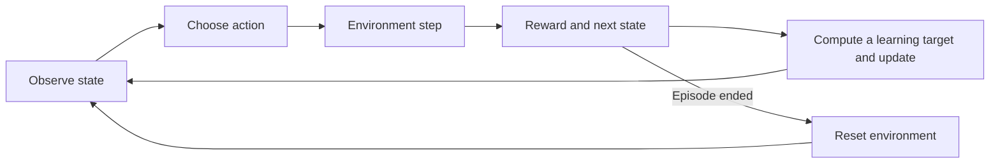

# Read the learning loop

You need basic Python, NumPy arrays, and—starting with DQN—PyTorch gradients.
Run each lesson from the repository root after `pip install -e .`.
You do not need YAML, TensorBoard, or the command-line experiment runner for this guide.

## The vocabulary

| Symbol | Meaning | Name in code |
| --- | --- | --- |
| s | Current state or observation | `state` / `observation` |
| a | Chosen action | `action` |
| r | Reward for this transition | `reward` |
| s′ | Observation after acting | `next_state` / `nxt` |
| γ | Discount on future rewards | `gamma` |
| α | Step size for learning | `learning_rate` |
| V(s) | Expected discounted return from a state | `state_values` / `critic` |
| Q(s,a) | Expected return after choosing an action | `q_table` / `q_network` |
| π(a\|s) | Probability of choosing an action | `policy` / `actor` |

An episode is one sequence from reset until termination or a time limit. A training step is
one interaction with the environment. An optimizer update changes network parameters. These
are different clocks: DQN updates every few steps; PPO updates several times per rollout.



## 1. Understand the environment before learning

Run `python -m examples.basic_navigation` and read
[`GridWorld.transition`](../src/minrl/environment/grid_world.py).
A state is a flattened row/column index. Actions are up, right, down, left.
The transition model returns a next state, a reward and a termination flag. `step()` uses
that same function and also updates the environment's position.

Rewards are paid on **entry** into a goal or trap. After termination, future reward is zero.
For example, with a goal of +1 at state 2, the path `0 → 1 → 2` receives `−0.1, +1`.
With γ=0.9 its discounted return is `−0.1 + 0.9 × 1 = 0.8`, not `1.7` or `1.8`.

An out-of-grid action stays in place and costs a step. Agents normally mask these actions;
policy evaluation also supports an explicitly supplied policy that assigns them probability.
Traps are terminal states, not impenetrable walls.

## 2. Planning: use a known transition model

Read [`policy_evaluation.py`](../src/minrl/agents/policy_evaluation.py), then
[`policy_optimization.py`](../src/minrl/agents/policy_optimization.py).

- Policy evaluation averages `r + γV(s′)` over a fixed policy's action probabilities.
- Value iteration takes the maximum over actions instead of the average.
- Policy iteration alternates complete policy evaluation with greedy improvement.

All terminal values are zero. Each sweep reads the previous value array, making the Bellman
update easy to inspect. Planning uses `transition()`, so it cannot move the live environment.

**Try:** set the sole goal to state 2 and γ=0.9. Confirm `V(1)=1`, `V(0)=0.8`, `V(2)=0`.
These same checks appear in `tests/test_learning.py`.

## 3. Q-learning: learn from individual transitions

Read [`q_learning.py`](../src/minrl/agents/q_learning.py): start at `train`, then `update`.

```text
target = reward + gamma * max_next_q       # max_next_q = 0 at a terminal state
error  = target - q_table[state, action]
q_table[state, action] += learning_rate * error
```

The epsilon-greedy policy explores with probability epsilon; otherwise it chooses the best
valid action. Learning uses the greedy next-state value even when the next behavior action
will explore. This is why Q-learning is called off-policy.

Start with `replay=False`. Later enable replay and inspect how the *same update rule* is
applied to older transitions. A replay batch here means several table updates, not a network.

**Try:** initialize a terminal state's Q-values to 100. An incoming terminal transition must
still have target +1. The terminal mask, not table initialization, guarantees this.

## 4. Monte Carlo: wait for a complete return

Read [`monte_carlo.py`](../src/minrl/agents/monte_carlo.py). Generate a complete episode,
compute its returns backwards, then average returns for each visited state. First-visit MC
uses only the earliest occurrence of a state; every-visit MC uses all occurrences.

For rewards `[1, 2]` at the same repeated state and γ=1, the two returns are `[3, 2]`.
First-visit gives 3; every-visit averages to 2.5. Unvisited states remain zero, which is an
initial estimate—not evidence that their true values are zero.

Partial episodes are reported and discarded. Increase `max_steps` if many are truncated;
discarding long episodes can bias the sample. Sparse reward alone does not imply that the
algorithm is incorrect or universally inferior.

## 5. MCTS: search before acting

[`mcts.py`](../src/minrl/agents/mcts.py) keeps four phases together in `_search`:
select using UCB, expand an unseen action, simulate from the leaf, then back up rewards.
Each edge receives its own immediate reward plus discounted future return. A direct move
into a goal therefore receives +1 even though the rollout after that goal has return zero.

## 6–8. From tables to neural networks

| Agent | Data collection | Learning target | When weights change |
| --- | --- | --- | --- |
| DQN | Epsilon-greedy transitions → replay | Reward + target-network next Q | Every `train_freq` steps |
| Actor-critic | One transition from current policy | One-step TD advantage | Every step |
| PPO | Fixed-policy rollout | GAE advantage and return | Several minibatch epochs per rollout |

Read the [DQN guide](dqn.md), [actor-critic guide](docs_algorithms_actor_critic.md), then
[PPO guide](docs_algorithms_ppo.md). The core functions are in their own algorithm files;
shared code only encodes observations, builds an MLP, masks actions and seeds randomness.

## The subtle boundary: termination versus truncation

Falling into a trap or failing CartPole truly terminates an episode. A time limit merely
stops collecting it. Both require reset, but only true termination makes future value zero.
For PPO, time truncation bootstraps from the final observation while ending the advantage
recursion before the reset observation. This avoids mixing two unrelated episodes.

## How to study an update

1. Run the short example and inspect one transition.
2. Calculate its target by hand before running `update()`.
3. Set the learning rate to 1 for a table, or 0 for inspecting a neural loss.
4. Run the corresponding test and change one reward or discount.
5. Only then compare longer learning curves and multiple seeds.

Loss and return answer different questions. A lower critic loss does not automatically mean
a better policy. Always evaluate without exploration, on a separate environment.
